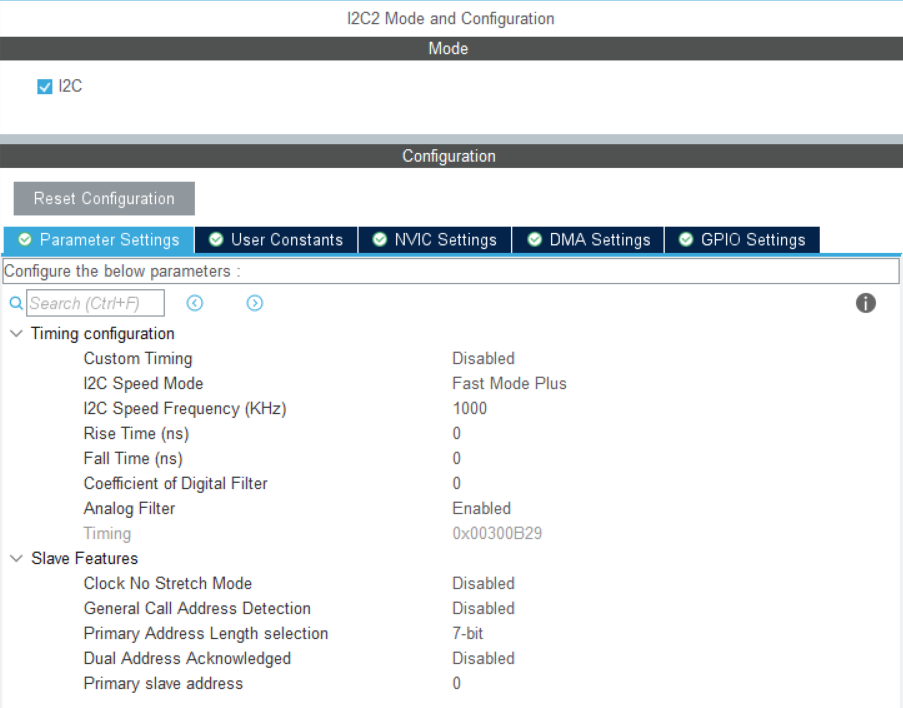
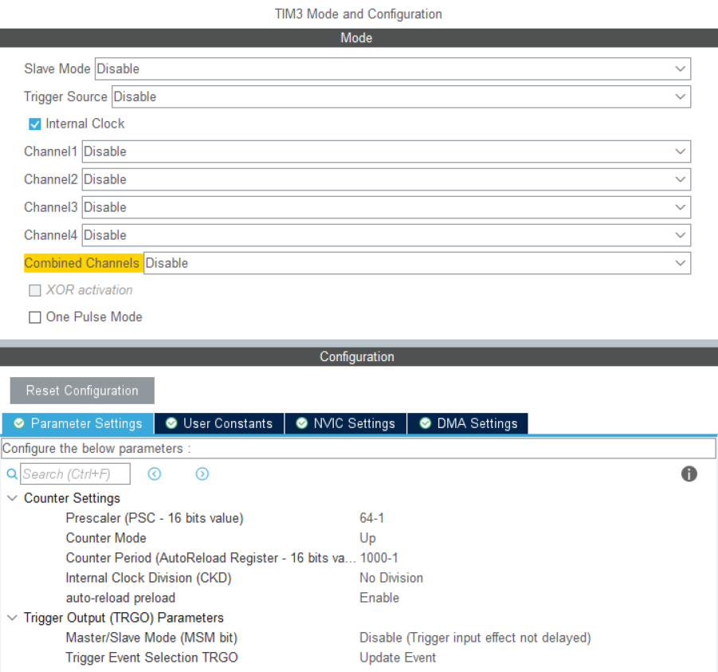
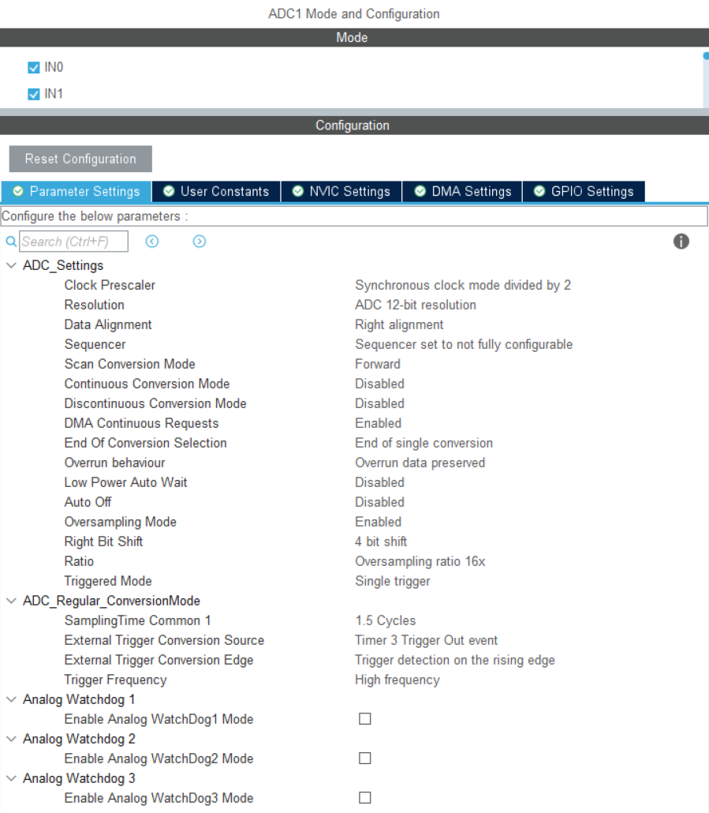
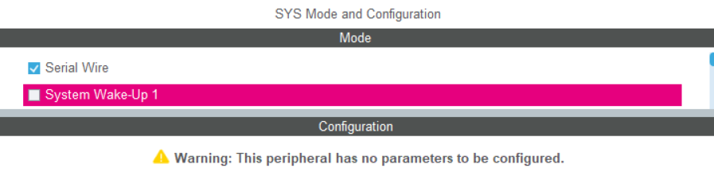
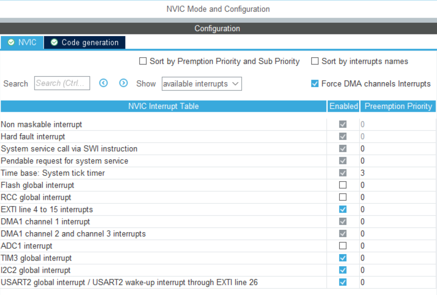
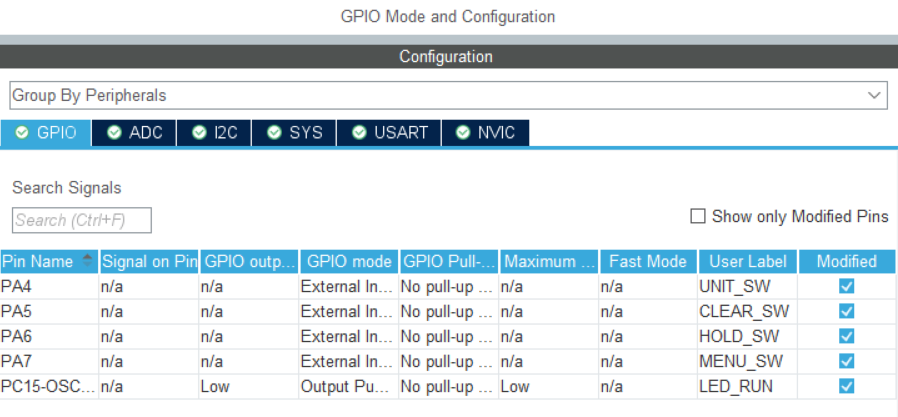
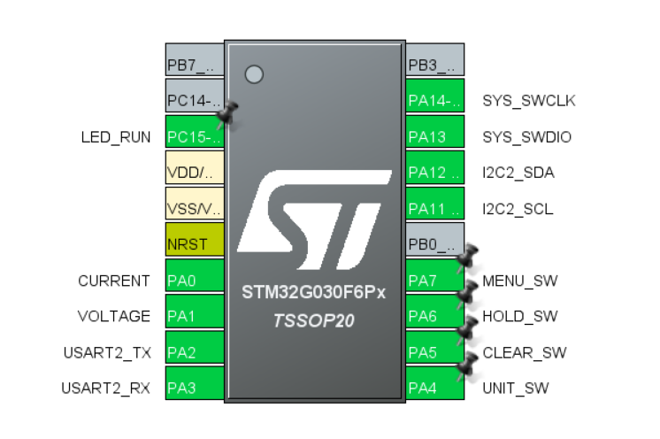
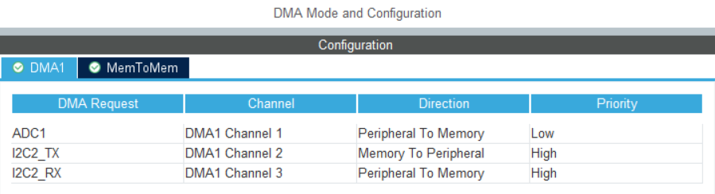
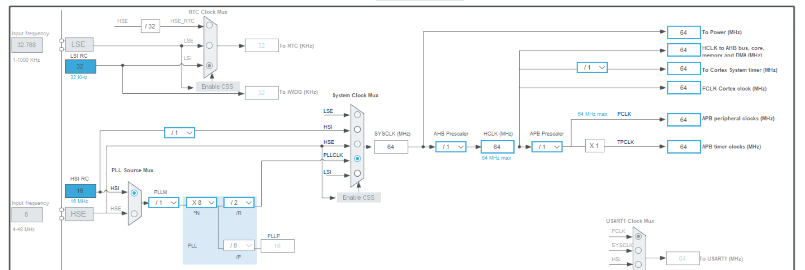

# PowerMonitorV1

* **PowerMonitorV1** 是一款基于 **STM32G030F6P6** 主控与 0.96 寸 I2C OLED 显示屏的便携式功率与电量监测计。

---

## 声明

* **开源协议**：本项目遵循 **GPL-3.0** 协议。
* **驱动来源**：本项目中的 0.96 寸 OLED 底层驱动库源自 **[江协科技 (Jiangxie Tech)](https://jiangxiekeji.com)**，将标准库的软件 I2C 重写成 HAL 库的非阻塞 I2C DMA 通信。
* **硬件工程**：本项目对应的 PCB 设计文件已发布至立创开源平台，硬件相应说明见连接 **[XT60功率与电量监测设备v1]( https://oshwhub.com/roboticlib/project_chgtzbxy)** 。

---

## 功能特性

* 使用 STM32G030F6P6 内部 12‑bit ADC 并过采样至 16‑bit，精确测量电压 (V) 与电流 (I)，实时计算功率 (P)。
* 根据系统运行时间自动累加总耗电量 (E / Wh)、总放电容量 (Q / mAh)。
* 支持 5 档屏幕刷新频率动态切换 (10ms ~ 200ms)。
* 内置交互状态机：画面冻结 (HOLD)、双视图切换、带二次确认的防误触数据清零。
* 包含电源指示灯与心跳灯，监测 MCU 是否在正常运行。
* 预留了一对 USART 接口，可以进一步开发与上位机的通信。

---

## 使用说明

设备配备四个独立按键 (`MENU`, `HOLD`, `CLR`, `UNIT`)，具体功能如下：

### 1. 视图切换 / 菜单 (MENU)
* **切换模式**：短按可在 **功率监测模式** (实时显示功率 P、电流 I、电压 V) 与 **电量统计模式** (累计显示能量 E、电量 Q、时间 T) 之间进行切换。
* **取消清零**：在弹出 `"Confirm CLEAR?"` 提示时，短按此键可取消操作并返回。

### 2. 画面冻结 (HOLD)
* **开启冻结**：短按可定格当前屏幕数据，停止刷新，便于记录瞬态数值。
* **取消冻结**：处于冻结状态时，**按下任意按键**即可立即解除锁定，恢复实时数据更新。

### 3. 安全清零 (CLR)
* **二次确认逻辑**：
    * **第一次短按**：进入待确认状态，屏幕提示 `"Confirm CLEAR?"`。
    * **第二次短按**：确认执行清零，后台所有累计数据 (能量 E、电量 Q、时间 T) 归零。
* *注：若需放弃清零，请在提示状态下按 `MENU` 键。*

### 4. 刷新率调节 (UNIT)
* **动态调整**：短按可循环调节 OLED 屏幕的渲染刷新周期。
* **档位循环**：`10ms` -> `25ms` -> `50ms` -> `100ms` -> `200ms` -> `10ms...`，依次循环。

---

## CUBEMX 配置说明

### I2C2 配置如图

### TIM3 配置如图

### ADC1 配置如图
* 只需要开启 IN0 和 IN1 用来输入电流和电压的模拟采样信号。

### SYS 配置如图

### NVIC 配置如图

### GPIO 以及 USER LABEL 设置如图

### DMA 配置如图
* I2C2_RX 可以不启用 DMA 这里仅用于传输到 OLED 屏幕，不需要 RX 。

### USART2 配置
* 这里只是启用了 USART2 ，如果需要相应功能可自行拓展。
### 时钟配置

## Keil 说明

### 必须用AC6编译器编译，编译必须选择-Oz image-size优化选项，否则会出现编译错误
* 移植工程的时候main函数内的ADC初始校准 **HAL_ADCEx_Calibration_Start(&hadc1);** **不能省略**，**否则**测量数据**严重失真**。

---
Copyright © 2026 LuoXiFNT
